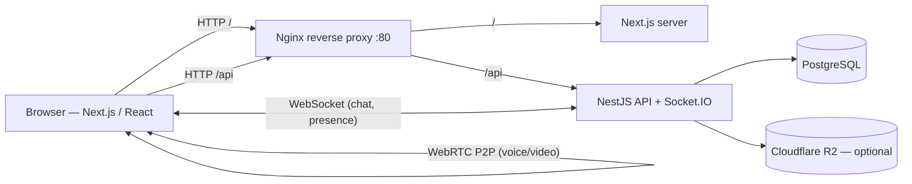

<div align="center">

# Saturn

### A real-time messaging platform — DMs, group chats, Discord-style communities & voice/video calls.

[](https://nextjs.org/)
[](https://react.dev/)
[](https://nestjs.com/)
[](https://www.prisma.io/)
[](https://www.postgresql.org/)
[](https://socket.io/)
[](https://www.docker.com/)
[](https://www.typescriptlang.org/)

**[Screenshots](#screenshots)** · **[Source](https://github.com/Franckprivat/Saturn)**

</div>

---

## Overview

**Saturn** is a full-stack real-time chat application I built to explore production-grade architecture: WebSocket messaging, peer-to-peer WebRTC calls, authentication, file storage and a themeable design system — all wired together and shipped with Docker and CI.

It combines the **1-to-1 / group messaging** of WhatsApp with the **server / channel** model of Discord, including voice and video calls.

> Built as a portfolio project to demonstrate full-stack ownership: from database modelling to real-time infrastructure, security and DX.

---

## Screenshots

| Real-time chat | Communities |
|:---:|:---:|
|  |  |
| **Profile & QR code** | |
|  | |

<!-- TODO: ajouter docs/call.png (appel vidéo) -->

---:|:---:|
|  |  |
| **Video call** | **Profile & themes** |
|  |  |

---

## Features

### Messaging
- **Real-time** 1-to-1 and group conversations over WebSockets (Socket.IO)
- **Typing indicators**, message **reactions**, and WhatsApp-style **read receipts** (sent / delivered / read)
- **Pinned messages**, replies and **file / image attachments** (JPEG, PNG, GIF, WebP, MP4, WebM, OGG, MP3, M4A, PDF, plain text, checked on actual content)
- Persistent history backed by PostgreSQL

### Social
- Friend system (requests, accept / decline)
- Group conversations with custom names
- Public **profiles** with bio, social links and a shareable **QR code**

### Communities (Discord-style)
- Create communities with **categories & channels**
- Member management and **invite links** (token-based)
- Per-channel real-time chat

### Calls
- **Voice & video calls** over **WebRTC** (peer-to-peer, mesh topology for groups)
- Call log history

### Experience
- **5 themes** (Light, Dark, Midnight, Solarized, Forest) + 6 accent colors, with an anti-FOUC bootstrap
- Customizable **avatars**: photo upload, gradient colors, or **DiceBear** generated avatars (16 styles, infinite variations)
- Fully **responsive** (mobile / tablet / desktop)

### Auth & Security
- Email/password authentication via **better-auth** (sessions, password reset)
- **Helmet** security headers, **rate limiting** (throttler), CORS allowlist
- Optional **Cloudflare R2** (S3-compatible) for durable file storage

---

## Tech Stack & Why

| Layer | Choice | Why |
|-------|--------|-----|
| **Frontend** | Next.js 16 (App Router) + React 19 | File-based routing, RSC, great DX and easy deployment |
| **State** | Zustand | Minimal, hook-based global state without Redux boilerplate |
| **Styling** | Tailwind CSS v4 + CSS variables | Utility-first speed + a runtime-switchable theme system |
| **Backend** | NestJS 11 | Modular, opinionated, DI-based — scales cleanly as features grow |
| **ORM** | Prisma 7 | Type-safe queries and migrations from a single schema (15 models) |
| **Database** | PostgreSQL 16 | Relational integrity for users, messages, communities |
| **Real-time** | Socket.IO | Rooms & reconnection handling for chat and presence |
| **Calls** | WebRTC | Low-latency P2P audio/video without routing media through a server |
| **Auth** | better-auth | Modern session-based auth with a clean TS API |
| **Infra** | Docker Compose + Nginx | One-command spin-up; Nginx reverse-proxies `/api` and `/` |
| **CI** | GitHub Actions | Lint + tests (backend) and lint + build (frontend) on every push |

---

## Architecture



**Repo layout**

```
Saturn/
├── backend/          # NestJS API (auth, chat, communities, conversations,
│   ├── src/          #   friends, messages, upload, users, gateway)
│   └── prisma/       # Schema (15 models) + migrations
├── frontend-web/     # Next.js App Router
│   ├── app/          # Pages: chat, communities, friends, calls, profile, auth
│   ├── components/   # AppShell, Avatar, modals, AuthLayout, …
│   └── store/        # Zustand stores (chat, theme)
├── nginx/            # Reverse-proxy config
└── docker-compose.yml
```

---

## Getting Started

**Prerequisites:** Node.js 20+, npm, Docker & Docker Compose.

```bash
git clone https://github.com/Franckprivat/Saturn.git saturn
cd saturn
```

Generate a session secret for `BETTER_AUTH_SECRET` with:

```bash
node -e "console.log(require('crypto').randomBytes(64).toString('hex'))"
```

### Option A — Docker Compose (recommended)

Uses **one env file: `.env` at the repo root**. Compose reads it for the Postgres credentials and passes it to the `backend` and `frontend-web` containers.

```bash
cp .env.example .env
#   -> set POSTGRES_USER / POSTGRES_PASSWORD, the same values in DATABASE_URL
#      and BETTER_AUTH_DATABASE_URL (host stays `db:5432`), and BETTER_AUTH_SECRET

docker compose up -d --build   # db + backend + frontend + nginx
```

The app is at **http://localhost**. The browser only talks to Nginx, which routes `/api`, `/api/auth`, `/uploads` and `/socket.io` to the backend and everything else to Next.js.

Stop with `docker compose down` (add `-v` to wipe the database).

### Option B — Run locally (hot reload)

Postgres still runs in Docker; the API and frontend run on your machine.

```bash
# 1. Database only (needs the root .env from Option A for POSTGRES_*)
cp .env.example .env
docker compose up -d db          # exposed on localhost:5433

# 2. Backend
cd backend
cp .env.example .env             # same POSTGRES_* credentials, but @localhost:5433
npm install
npx prisma migrate deploy
npm run dev                      # http://localhost:3001

# 3. Frontend (new terminal)
cd frontend-web
cp .env.local.example .env.local # optional: defaults already target :3001
npm install
npm run dev                      # http://localhost:3000
```

| | Docker (root `.env`) | Local (`backend/.env`) |
|---|---|---|
| `DATABASE_URL` host | `db:5432` | `localhost:5433` |
| `BETTER_AUTH_URL` | `http://localhost` (Nginx) | `http://localhost:3001` |
| Browser → backend | `http://localhost/api` via Nginx | `http://localhost:3001` direct |

### Demo account

To try Saturn without signing up, click **"Try the demo account"** on the landing or login page.

| Email | Password |
|---|---|
| `demo@example.com` | `saturn-demo` |

The account already has friends, conversations, a group and a community. It is shared, so changing its password or email and deleting it are blocked, and its sample data is restored every time the backend restarts.

Enable it in the backend env file:

```env
DEMO_ACCOUNT_ENABLED=true
# Optional
DEMO_ACCOUNT_EMAIL=demo@example.com
DEMO_ACCOUNT_PASSWORD=saturn-demo
```

### Environment variables

| Variable | Required | Description |
|----------|:--------:|-------------|
| `POSTGRES_USER` / `POSTGRES_PASSWORD` / `POSTGRES_DB` | yes | Postgres credentials |
| `DATABASE_URL` | yes | Prisma connection string |
| `BETTER_AUTH_DATABASE_URL` | yes | Auth DB (same database, without `?schema=public`) |
| `BETTER_AUTH_SECRET` | yes | Session signing secret |
| `BETTER_AUTH_URL` | yes | Public URL of the API (see table above) |
| `ALLOWED_ORIGINS` | yes | CORS allowlist |
| `PORT` | no | API port (default `3001`) |
| `SMTP_*` | no | Email (password reset). Without `SMTP_USER`, reset links are not sent and the backend logs a warning |
| `R2_*` | no | Cloudflare R2 file storage (falls back to local disk) |
| `TRUST_PROXY` | no | Express `trust proxy` value. Default `loopback, linklocal, uniquelocal` (Nginx in the Docker network); e.g. `1` behind a single load balancer |
| `DEMO_ACCOUNT_ENABLED` / `DEMO_ACCOUNT_EMAIL` / `DEMO_ACCOUNT_PASSWORD` | no | Shared demo account (see above) |
| `NEXT_PUBLIC_API_URL` / `NEXT_PUBLIC_AUTH_URL` | no | Frontend → API URLs (set by Compose; default `http://localhost:3001`) |

### Production notes

- Keep the backend port (`3001`) private and expose only Nginx. Auth rate limiting reads the client IP from the `X-Real-IP` header set by Nginx.
- Migrations run on container start; outside Docker, run `npx prisma migrate deploy` after pulling.

---

## Tests & Quality

```bash
cd backend && npm test         # Jest unit tests
cd backend && npm run lint:ci  # ESLint (no auto-fix)
cd frontend-web && npm run build
```

CI runs lint + tests on every push via GitHub Actions.

---

## What I Learned

- **Real-time at scale** — designing Socket.IO rooms for DMs, groups and community channels, plus presence and read receipts.
- **WebRTC from scratch** — signalling over WebSockets and a mesh topology for multi-party calls, without an SFU.
- **A runtime theme system** — driving the whole UI from CSS variables so 5 themes switch live, including an anti-FOUC bootstrap script to avoid a flash on reload.
- **Containerized DX** — reproducible environments with Docker Compose + Nginx, and debugging real-world issues (port conflicts, volume permissions, stale build caches).
- **Schema-first modelling** — 15 related Prisma models with safe migrations on non-empty tables.

---

## Roadmap

- [ ] Server-side persistence for the call log
- [ ] Push notifications
- [ ] Community roles & moderation
- [ ] E2E tests (Playwright)
- [ ] Message search

---

## Author

**Franck** <!-- TODO: nom complet --> — _Looking for a work-study (alternance) in software development._

[](https://github.com/Franckprivat)
<!-- TODO: badge LinkedIn
[](https://linkedin.com/in/TON-PROFIL)
-->

---

<div align="center">
<sub>Built with NestJS, Next.js & a lot of WebSockets.</sub>
</div>
